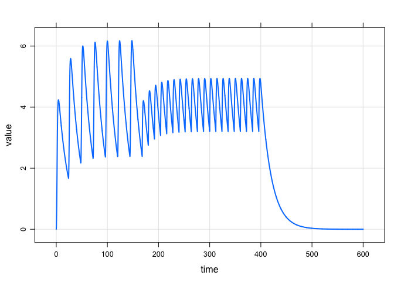
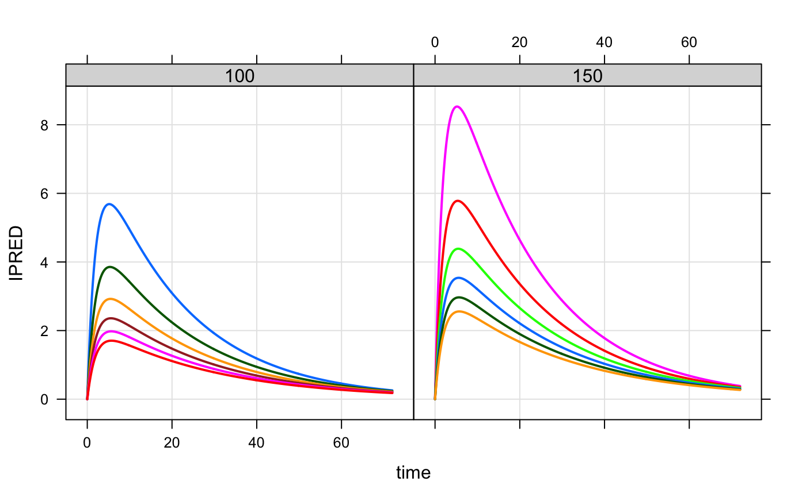
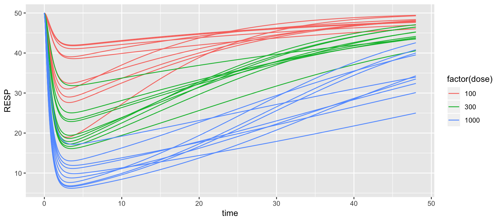

# mrgsolve 

[](https://travis-ci.org/metrumresearchgroup/mrgsolve)
[](https://cran.r-project.org/package=mrgsolve)
[](http://www.gnu.org/licenses/gpl-2.0.html)
[](https://github.com/metrumresearchgroup/mrgsolve/issues)
[](http://metrumrg.com)

mrgsolve is an R package for simulation from hierarchical, ordinary
differential equation (ODE) based models typically employed in drug
development. mrgsolve is free and open-source software.

## Resources

Please see [mrgsolve.github.io](https://mrgsolve.github.io) for
additional resources, including:

  - [User Guide](https://mrgsolve.github.io/user_guide)
  - [R Documentation](https://mrgsolve.github.io/docs)
  - [Vignettes](https://mrgsolve.github.io/vignettes)
  - [Gallery](https://github.com/mrgsolve/gallery)

## Installation

We recommend staying up to date with the development version

``` r
devtools::install_github("metrumresearchgroup/mrgsolve")
```

Otherwise, install the latest release on CRAN

``` r
install.packages("mrgsolve")
```

**Please** be sure to see important install-related information
[here](https://github.com/metrumresearchgroup/mrgsolve/wiki/mrgsolve-Installation).

## Interaction

We welcome **questions** about anything mrgsolve: installation, getting
your model to work, understanding better how mrgsolve works. We also
welcome **suggestions** for how to make mrgsolve more useful to you and
to the pharmacometrics community.

Please interact with us at the [Issue
Tracker](https://github.com/metrumresearchgroup/mrgsolve/issues). This
requires a GitHub account.

## Some examples

### A simple simulation

``` r
library(mrgsolve)
```

Load a model from the internal library

``` r
mod <- mread("pk1", modlib())
```

Simulate a simple regimen

``` r
mod %>% 
  ev(amt = 100, ii = 24, addl = 9) %>%
  mrgsim(end = 300, delta = 0.1) %>% 
  plot(CP~time)
```


A more complicated regimen: 100 mg infusions over 2 hours every 24 hours
for one week, followed by 50 mg boluses every 12 hours for 10 days:

``` r
mod %>% 
  ev_rx("100 over 2h q 24 x 7 then 50 q 12 x 20") %>%
  mrgsim(end = 600, delta = 0.1) %>% 
  plot(CP~time)
```



### Population simulation

``` r
mod <- mread("popex", modlib()) %>% zero_re()
```

A data set looking at different patient weights and doses

``` r
library(dplyr)

data <- expand.ev(amt = c(100,150), WT = seq(40,140,20)) %>% mutate(dose = amt)

head(data)
```

    .   ID amt WT evid cmt time dose
    . 1  1 100 40    1   1    0  100
    . 2  2 150 40    1   1    0  150
    . 3  3 100 60    1   1    0  100
    . 4  4 150 60    1   1    0  150
    . 5  5 100 80    1   1    0  100
    . 6  6 150 80    1   1    0  150

Simulate

``` r
mod %>% 
  data_set(data) %>% 
  carry_out(dose,WT) %>%
  mrgsim(delta = 0.1, end = 72) %>% 
  plot(IPRED~time|factor(dose),scales = "same")
```



### Sensitivity analysis with PBPK model

``` r
mod <- mread("pbcsa", modlib())
```

Reference

``` r
blocks(mod,PROB) 
```

``` 
  
  Model file: pbcsa.cpp 
  
  $PROB
  # Yoshikado et al. (2016)
  - Title: __Quantitative Analyses of Hepatic OATP-Mediated
  Interactions Between Statins and Inhibitors Using PBPK
  Modeling With a Parameter Optimiaztion Method__
  - Reference: CP\&T vol. 100 no. 5 pp. 513-23 11/2016
  - Parameters: 40
  - Compartments: 31
```

Model parameters

``` r
param(mod)
```

    . 
    .  Model parameters (N=26):
    .  name    value   . name  value 
    .  Clr     0       | PSadi 0.17  
    .  exFadi  0.145   | PSmus 4.08  
    .  exFliv  0.278   | PSski 0.623 
    .  exFmus  0.146   | Qadi  0.223 
    .  exFski  0.321   | Qh    1.2   
    .  fafg    0.572   | Qmus  0.642 
    .  fb      0.06    | Qski  0.257 
    .  fhCLint 0.00978 | tlag  0.254 
    .  ka      0.999   | Vadi  0.143 
    .  Kp_adi  17.3    | Vcent 0.075 
    .  Kp_liv  16.7    | Vliv  0.0241
    .  Kp_mus  2.98    | Vmus  0.429 
    .  Kp_ski  13.6    | Vski  0.111

Set up a batch to simulate

``` r
idata <- expand.idata(Kp_liv = seq(4,20,2))

idata
```

    .   ID Kp_liv
    . 1  1      4
    . 2  2      6
    . 3  3      8
    . 4  4     10
    . 5  5     12
    . 6  6     14
    . 7  7     16
    . 8  8     18
    . 9  9     20

``` r
mod %>% 
  ev(amt = 2000) %>% 
  idata_set(idata) %>%
  mrgsim(end = 24, delta = 0.1) %>%
  plot(CSA~time, scale = list(y = list(log =TRUE, at = 10^seq(-4,4))))
```


