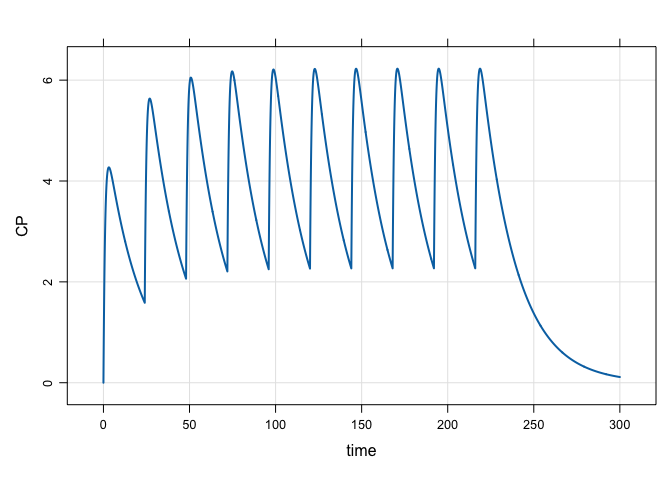
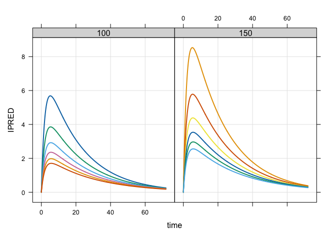
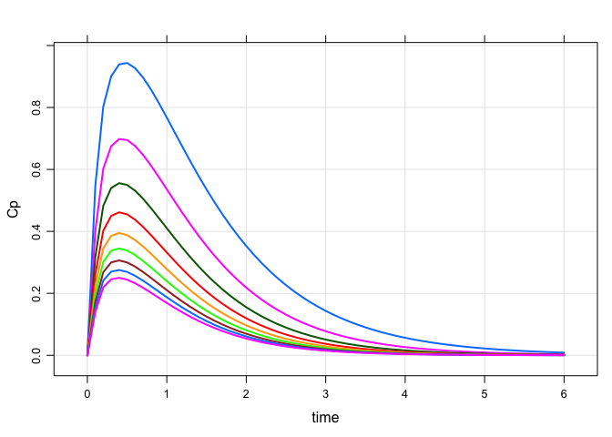

# mrgsolve 

[](https://github.com/metrumresearchgroup/mrgsolve/actions/workflows/main.yaml)
[](https://cran.r-project.org/package=mrgsolve)
[](http://www.gnu.org/licenses/gpl-2.0.html)
[](https://github.com/metrumresearchgroup/mrgsolve/issues)
[](http://metrumrg.com)

mrgsolve is an R package for simulation from hierarchical, ordinary
differential equation (ODE) based models typically employed in drug
development. mrgsolve is free and open-source software.

## Resources

Please see [mrgsolve.github.io](https://mrgsolve.github.io) for
additional resources, including:

- [User Guide](https://mrgsolve.github.io/user_guide)
- [R Documentation](https://mrgsolve.github.io/docs)
- [Vignettes](https://mrgsolve.github.io/vignettes)
- [Gallery](https://github.com/mrgsolve/gallery)

## Installation

Install the latest release on CRAN

``` r
install.packages("mrgsolve")
```

**Please** be sure to see important install-related information
[here](https://github.com/metrumresearchgroup/mrgsolve/wiki/mrgsolve-Installation).

Install the current development version

``` r
remotes::install_github("metrumresearchgroup/mrgsolve")
```

## Interaction

We welcome **questions** about anything mrgsolve: installation, getting
your model to work, understanding better how mrgsolve works. We also
welcome **suggestions** for how to make mrgsolve more useful to you and
to the pharmacometrics community.

Please interact with us at the [Issue
Tracker](https://github.com/metrumresearchgroup/mrgsolve/issues). This
requires a GitHub account.

## Some examples

### A simple simulation

``` r
library(mrgsolve)
```

Load a model from the internal library

``` r
mod <- mread("pk1", modlib())
```

Simulate a simple regimen

``` r
mod %>% 
  ev(amt = 100, ii = 24, addl = 9) %>%
  mrgsim(end = 300, delta = 0.1) %>% 
  plot(CP~time)
```

<!-- -->

A more complicated regimen: 100 mg infusions over 2 hours every 24 hours
for one week, followed by 50 mg boluses every 12 hours for 10 days:

``` r
mod %>% 
  ev_rx("100 over 2h q 24 x 7 then 50 q 12 x 20") %>%
  mrgsim(end = 600, delta = 0.1) %>% 
  plot(CP~time)
```

<!-- -->

### Population simulation

``` r
mod <- mread("popex", modlib()) %>% zero_re()
```

A data set looking at different patient weights and doses

``` r
library(dplyr)

data <- expand.ev(amt = c(100,150), WT = seq(40,140,20)) %>% mutate(dose = amt)

head(data)
```

    .   ID time amt cmt evid WT dose
    . 1  1    0 100   1    1 40  100
    . 2  2    0 150   1    1 40  150
    . 3  3    0 100   1    1 60  100
    . 4  4    0 150   1    1 60  150
    . 5  5    0 100   1    1 80  100
    . 6  6    0 150   1    1 80  150

Simulate

``` r
mod %>% 
  data_set(data) %>% 
  carry_out(dose,WT) %>%
  mrgsim(delta = 0.1, end = 72) %>% 
  plot(IPRED~time|factor(dose),scales = "same")
```

<!-- -->

### Sensitivity analysis with PBPK model

``` r
mod <- modlib("pbpk")
```

    . Building pbpk ... done.

Reference

      
      Model file: pbpk.cpp 
      
      $PROB
      # HUMAN PBPK MODEL
      1: Jones H, Rowland-Yeo K. Basic concepts in physiologically based
      pharmacokinetic modeling in drug discovery and development. CPT Pharmacometrics
      Syst Pharmacol. 2013 Aug 14;2:e63. doi: 10.1038/psp.2013.41. PubMed PMID:
      23945604; PubMed Central PMCID: PMC3828005.

Model parameters

``` r
param(mod)
```

    . 
    .  Model parameters (N=52):
    .  name    value  . name  value  . name      value 
    .  BP      0.98   | fumic 1      | FVve      0.0514
    .  BW      70     | fup   0.681  | HLM_CLint 8     
    .  CLrenal 0      | FVad  0.213  | Ka        2.18  
    .  CO      108    | FVar  0.0257 | Kpad      0.191 
    .  F       1      | FVbo  0.0856 | Kpbo      0.374 
    .  FQad    0.05   | FVbr  0.02   | Kpbr      0.606 
    .  FQbo    0.05   | FVgu  0.0171 | Kpgu      0.578 
    .  FQbr    0.12   | FVhe  0.0047 | Kphe      0.583 
    .  FQgu    0.146  | FVki  0.0044 | Kpki      0.597 
    .  FQh     0.215  | FVli  0.021  | Kpli      0.57  
    .  FQhe    0.04   | FVlu  0.0076 | Kplu      0.62  
    .  FQki    0.19   | FVmu  0.4    | Kpmu      0.622 
    .  FQlu    1      | FVpl  0.0424 | Kpre      0.6   
    .  FQmu    0.17   | FVrb  0.0347 | Kpsk      0.6   
    .  FQre    0.104  | FVre  0.0998 | Kpsp      0.591 
    .  FQsk    0.05   | FVsk  0.0371 | Kpte      0.6   
    .  FQsp    0.0172 | FVsp  0.0026 | .         .     
    .  FQte    0.0108 | FVte  0.01   | .         .

Set up a batch to simulate

``` r
idata <- expand.idata(Kpli = seq(4,20,2))

idata
```

    .   ID Kpli
    . 1  1    4
    . 2  2    6
    . 3  3    8
    . 4  4   10
    . 5  5   12
    . 6  6   14
    . 7  7   16
    . 8  8   18
    . 9  9   20

``` r
mod %>% 
  ev(amt = 150) %>% 
  idata_set(idata) %>%
  mrgsim(end = 6, delta = 0.1) %>%
  plot(Cp~time)
```

<!-- -->
