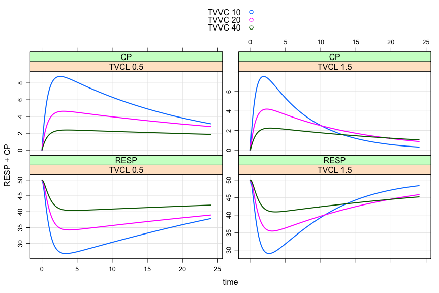

# 
  
  


# Resources

* [Gallery](https://github.com/metrumresearchgroup/mrgsolve/wiki/gallery)
* [Wiki](https://github.com/metrumresearchgroup/mrgsolve/wiki)
    * [Upcoming changes](https://github.com/metrumresearchgroup/mrgsolve/wiki/Upcoming-changes)
    * [Windows issues](https://github.com/metrumresearchgroup/mrgsolve/wiki/Windows-issues#issues-with-using-mrgsolve-on-windows-platforms)
* [`mrgsolve` discussion](http://metrumresearchgroup.github.io/mrgsolve_group/)
* [Issue tracker](https://github.com/metrumresearchgroup/mrgsolve/issues)

# Latest release
[v0.5.11](https://github.com/metrumresearchgroup/mrgsolve/releases/tag/v0.5.11)


<hr>


# About

## `mrgsolve` is open-source software distributed as a package for `R`
  
  * Licensed under: 
  * Installs via `R` package compile and install system
  * Easy integration with any other relevant `R` functionality
     * Graphics: `lattice`, `ggplot2`
     * Model estimation: `nls`,`nlme`, `MCMCpack`, `saemix`, others
     * Optimal design: `PFIM`, `PopED`
     * Data summary: `dplyr` and many other functions and packages
     * Interactive model exploration with `shiny`
     


```r
library(mrgsolve)
library(dplyr)
library(ggplot2)
```

## The model specification file is similar to other non-linear mixed effects modeling software


```r
code <- '
$GLOBAL 
#define CP (CENT/VC)
#define INH (CP/(IC50+CP))

$SET delta=0.1

$PARAM TVCL=1, TVVC=20, KA = 1.3, KIN=100, KOUT=2, IC50=10

$CMT GUT, CENT, RESP

$MAIN
  double CL = exp(log(TVCL) + ETA(1));
  double VC = exp(log(TVVC) + ETA(2));

  RESP_0 = KIN/KOUT;

$OMEGA 0 0

$ODE
  dxdt_GUT = -KA*GUT;
  dxdt_CENT = KA*GUT - (CL/VC)*CENT;
  dxdt_RESP = KIN*(1-INH) - KOUT*RESP;

$TABLE capture(CP);
'
```

The model is parsed, compiled, and dynamically loaded into the `R` session

  * Information about the model is saved as an `R` object
  * Important model attributes can be updated in `R` without recompiling


```r
mod <- mread(code=code, model="demo")
```

# Use `mrgsolve` as an interactive simulation tool for model exploration and sensitivity analyses
  * Simulated data are returned as `R` objects
  * Input and output data are kept in memory in the `R` process; writing or reading to disk
  is never necessary (unless results are to be saved for later use).


```r
out <- mod %>% 
  ev(amt=100, ii=24, addl=2) %>%
  mrgsim(end=120)

out
```

```
. Model:  demo.cpp 
. Date:   Sun Feb 21 21:47:14 2016 
. Dim:    1202 x 6 
. Time:   0 to 120 
. ID:     1 
.      ID time    GUT  CENT  RESP    CP
. [1,]  1  0.0   0.00  0.00 50.00 0.000
. [2,]  1  0.0 100.00  0.00 50.00 0.000
. [3,]  1  0.1  87.81 12.16 49.72 0.608
. [4,]  1  0.2  77.11 22.78 49.03 1.139
. [5,]  1  0.3  67.71 32.04 48.11 1.602
. [showing 4 significant digits]
```

```r
plot(out, CP+RESP~.)
```


```r
out <- mod %>%
  ev(amt=100, ii=24, addl=2) %>%
  Req(CP,RESP) %>%
  knobs(TVVC=c(10,20,40), CL=c(1,2))
```

```r
plot(out)
```



## Also use `mrgsolve` for efficient, large-scale population simulation


```r
mod <- mod %>% omat(cmat(0.1, 0.67, 0.4))
```

## Flexibility with input data sets
* Data set format that is likely familiar to modeling and simulation scientists 
* No need to include observation records; `mrgsolve` will automatically insert 


```r
data <- expand.ev(ID=1:10, amt=c(100,300,1000)) %>%
  mutate(dose=amt)

head(data)
```

```
.   ID amt evid cmt time dose
. 1  1 100    1   1    0  100
. 2  2 100    1   1    0  100
. 3  3 100    1   1    0  100
. 4  4 100    1   1    0  100
. 5  5 100    1   1    0  100
. 6  6 100    1   1    0  100
```

### Input data are passed in as `R` objects
  * Pass many different data sets or implement different designs in the same model code
  without recompiling
  * Control simulation output from `R` to better manage memory


```r
out <- mod %>%
  data_set(data) %>%
  Req(RESP,CP) %>% obsonly %>%
  carry.out(evid,amt,dose) %>%
  mrgsim(end=48, seed=1010)
```

```r
plot(out, RESP~time|factor(dose), scales="same")
```


## Pass simulated output to your favorite data summary or visualization routines
Summarise with `dplyr`


```r
out %>% 
  as.tbl %>%
  group_by(dose) %>%
  summarise(rmin = min(RESP), tmim=time[which.min(RESP)])
```

```
. Source: local data frame [3 x 3]
. 
.    dose      rmin  tmim
.   (dbl)     (dbl) (dbl)
. 1   100 18.958869   2.9
. 2   300 16.117261   3.5
. 3  1000  6.198648   3.5
```

Plot with `ggplot2`


```r
out %>% 
  as.tbl %>%
  ggplot(data=.) + 
  geom_line(aes(x=time, y=RESP, group=ID, col=factor(dose))) 
```


<hr>
<center><i>Metrum Research Group, LLC 2 Tunxis Rd Suite 112 Tariffville, CT 06081 </i></center>
<br>
<br>

---
title: "README.R"
author: "kyleb"
date: "Sun Feb 21 21:47:13 2016"
---
