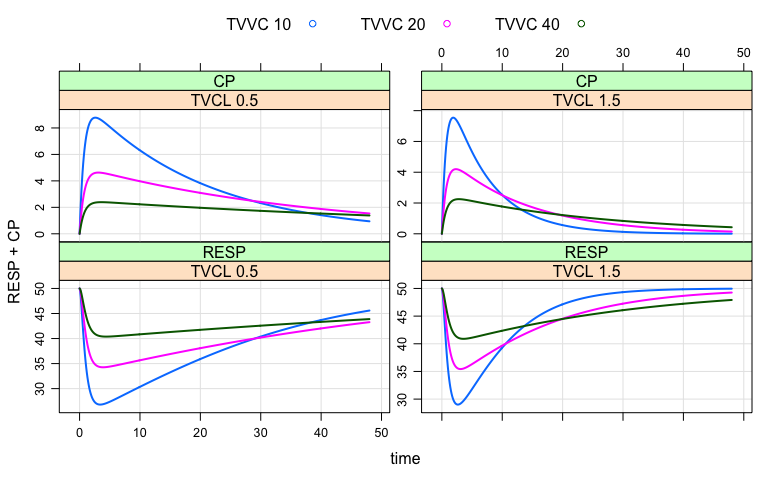
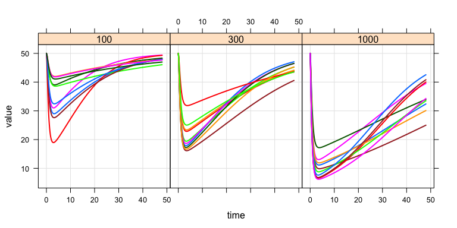

[](https://travis-ci.org/metrumresearchgroup/mrgsolve.svg?branch=master) [](https://groups.google.com/a/metrumrg.com/forum/#!forum/mrgsolve)

About
=====

`mrgsolve` facilitates simulation in R from hierarchical, ordinary differential equation (ODE) based models typically employed in drug development. See the example below.

Installation
============

``` r
  devtools::install_github("metrumresearchgroup/mrgsolve")
```

Also see important install-related information [here](https://github.com/metrumresearchgroup/mrgsolve/wiki/mrgsolve-Installation)

Ask a question
==============

-   [Issue tracker (preferred)](https://github.com/metrumresearchgroup/mrgsolve/issues) (requires GitHub account; ok for questions or issue reports)
-   [Google Group](https://groups.google.com/a/metrumrg.com/forum/#!forum/mrgsolve) (email list or web-based discussion)

Resources
=========

Please see [mrgsolve.github.io](https://mrgsolve.github.io) for additional resources

<hr>
Example
=======

``` r
library(mrgsolve)
library(dplyr)
library(ggplot2)
```

The model specification file is similar to other non-linear mixed effects modeling software
-------------------------------------------------------------------------------------------

``` r
code <- '
$GLOBAL
#define CP (CENT/VC)
#define INH (CP/(IC50+CP))

$SET delta=0.1

$PARAM TVCL=1, TVVC=20, KA = 1.3, KIN=100, KOUT=2, IC50=10

$CMT GUT CENT RESP

$MAIN
  double CL = exp(log(TVCL) + ETA(1));
  double VC = exp(log(TVVC) + ETA(2));

  RESP_0 = KIN/KOUT;

$OMEGA 0 0

$ODE
  dxdt_GUT = -KA*GUT;
  dxdt_CENT = KA*GUT - (CL/VC)*CENT;
  dxdt_RESP = KIN*(1-INH) - KOUT*RESP;

$CAPTURE CP
'
```

The model is parsed, compiled, and dynamically loaded into the `R` session

-   Information about the model is saved as an `R` object
-   Important model attributes can be updated in `R` without recompiling

``` r
mod <- mcode("demo", code)
```

Use `mrgsolve` as an interactive simulation tool for model exploration and sensitivity analyses
===============================================================================================

-   Simulated data are returned as `R` objects
-   Input and output data are kept in memory in the `R` process; writing or reading to disk is never necessary (unless results are to be saved for later use).

``` r
out <- 
  mod %>%
  ev(amt=100, ii=24, addl=2) %>%
  mrgsim(end=120)

out
```

    . Model:  demo.cpp 
    . Dim:    1202 x 6 
    . Time:   0 to 120 
    . ID:     1 
    .      ID time    GUT  CENT  RESP    CP
    . [1,]  1  0.0   0.00  0.00 50.00 0.000
    . [2,]  1  0.0 100.00  0.00 50.00 0.000
    . [3,]  1  0.1  87.81 12.16 49.72 0.608
    . [4,]  1  0.2  77.11 22.78 49.03 1.139
    . [5,]  1  0.3  67.71 32.04 48.11 1.602
    . [6,]  1  0.4  59.45 40.11 47.06 2.006
    . [7,]  1  0.5  52.20 47.14 45.96 2.357
    . [8,]  1  0.6  45.84 53.25 44.87 2.663

``` r
plot(out, CP+RESP~.)
```


``` r
out <- 
  mod %>% update(end=48) %>%
  ev(amt=100) %>%
  Req(CP,RESP) %>%
  knobs(TVVC=c(10,20,40), TVCL=c(0.5,1.5))
```

``` r
plot(out)
```



Also use `mrgsolve` for efficient, large-scale population simulation
--------------------------------------------------------------------

``` r
mod <- mod %>% omat(cmat(0.1, 0.67, 0.4))
```

Flexibility with input data sets
--------------------------------

-   Data set format that is likely familiar to modeling and simulation scientists
-   No need to include observation records; `mrgsolve` will automatically insert

``` r
.data <- 
  expand.ev(ID=1:10, amt=c(100,300,1000)) %>%
  mutate(dose=amt)

head(.data)
```

    .   ID amt evid cmt time dose
    . 1  1 100    1   1    0  100
    . 2  2 100    1   1    0  100
    . 3  3 100    1   1    0  100
    . 4  4 100    1   1    0  100
    . 5  5 100    1   1    0  100
    . 6  6 100    1   1    0  100

### Input data are passed in as `R` objects

-   Pass many different data sets or implement different designs in the same model code without recompiling
-   Control simulation output from `R` to better manage memory

``` r
out <- 
  mod %>%
  data_set(.data) %>%
  Req(RESP,CP) %>% obsonly %>%
  carry_out(dose) %>%
  mrgsim(end=48, seed=1010)
```

``` r
plot(out, RESP~time|factor(dose), scales="same")
```



Pass simulated output to your favorite data summary or visualization routines
-----------------------------------------------------------------------------

Summarise with `dplyr`

``` r
out %>%
  as.tbl %>%
  group_by(dose) %>%
  summarise(rmin = min(RESP), tmim=time[which.min(RESP)])
```

    . # A tibble: 3 × 3
    .    dose      rmin  tmim
    .   <dbl>     <dbl> <dbl>
    . 1   100 18.958869   2.9
    . 2   300 16.117261   3.5
    . 3  1000  6.198648   3.5

Plot with `ggplot2`

``` r
out %>%
  as.tbl %>%
  ggplot(data=.) +
  geom_line(aes(x=time, y=RESP, group=ID, col=factor(dose)))
```


