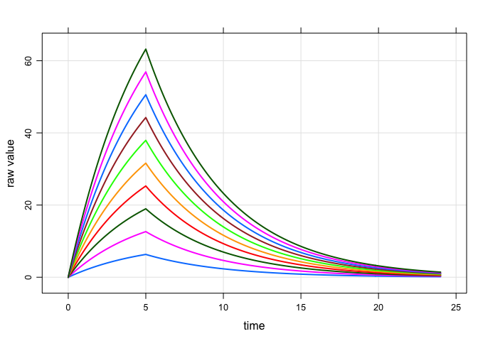

``` r
library(mrgsolve, lib.loc="~/Rlibs/0.5.11")
library(dplyr)
library(magrittr)
```

Infusions with varying `F`
==========================

A model with infusion

``` r
code <- '
$SET delta=0.1, end=24

$GLOBAL
// In next version, we wont have to do this explicitly to get the nice aliases
#define F_CENT _F(1)
#define R_CENT _R(1)
#define D_CENT _D(1)

$PARAM CL = 1, VC = 5, F1 = 1, D1 = 5, R1 = 20

$CMT CENT

$MAIN
F_CENT = F1;
D_CENT = D1;
R_CENT = R1;

$ODE
dxdt_CENT  = -(CL/VC)*CENT;

'
```

``` r
mod <- mread("infusion", tempdir(), code)
```

Run with `rate=-1`: `F` and `amt` determine duration. Only `F1==1` gets the 5 hour infusion.

``` r
data <- expand.ev(amt=100,F1=seq(0.1,1,0.1),rate=-1)
```

``` r
mod %>%
  data_set(data) %>%
  mrgsim %>% 
  plot
```

<!-- -->

Run with `rate=-2`: duration is set by `D`. Now, `D` is enforced ... everyone gets 5 hour infusion

``` r
data <- expand.ev(amt=100,F1=seq(0.1,1,0.1),rate=-2)
```

``` r
mod %>%
  data_set(data) %>%
  mrgsim %>% 
  plot
```

<!-- -->

We can't do something like this ...

``` r
data <- expand.ev(amt=100,F1=seq(0.1,1,0.1)) %>% mutate(rate=amt/5)
```

``` r
head(data)
```

    .   ID amt  F1 evid cmt time rate
    . 1  1 100 0.1    1   1    0   20
    . 2  2 100 0.2    1   1    0   20
    . 3  3 100 0.3    1   1    0   20
    . 4  4 100 0.4    1   1    0   20
    . 5  5 100 0.5    1   1    0   20
    . 6  6 100 0.6    1   1    0   20

... and expect to get a 5 hour infusion

``` r
mod %>%
  data_set(data) %>%
  mrgsim %>% 
  plot
```

<!-- -->

But we **could** do this to ensure duration is 5

``` r
data <- expand.ev(amt=100,F1=seq(0.1,1,0.1),D1 = 5)
data %<>% mutate(amt=amt*F1, rate = amt/D1) %>% select(-F1,-D1) %>% mutate(F1=1)
```

``` r
data
```

    .    ID amt evid cmt time rate F1
    . 1   1  10    1   1    0    2  1
    . 2   2  20    1   1    0    4  1
    . 3   3  30    1   1    0    6  1
    . 4   4  40    1   1    0    8  1
    . 5   5  50    1   1    0   10  1
    . 6   6  60    1   1    0   12  1
    . 7   7  70    1   1    0   14  1
    . 8   8  80    1   1    0   16  1
    . 9   9  90    1   1    0   18  1
    . 10 10 100    1   1    0   20  1

``` r
mod %>%
  data_set(data) %>%
  mrgsim %>% 
  plot
```

<!-- -->

The key is to make all of the adjustments **either** (1) in the control stream **or** (2) in the data.

`sessionInfo`

    . R version 3.2.3 (2015-12-10)
    . Platform: x86_64-apple-darwin13.4.0 (64-bit)
    . Running under: OS X 10.9.5 (Mavericks)
    . 
    . locale:
    . [1] en_US.UTF-8/en_US.UTF-8/en_US.UTF-8/C/en_US.UTF-8/en_US.UTF-8
    . 
    . attached base packages:
    . [1] stats     grDevices utils     datasets  graphics  methods   base     
    . 
    . other attached packages:
    . [1] knitr_1.12.3    magrittr_1.5    dplyr_0.4.3     mrgsolve_0.5.11
    . 
    . loaded via a namespace (and not attached):
    .  [1] Rcpp_0.12.3     lattice_0.20-33 digest_0.6.9    assertthat_0.1 
    .  [5] grid_3.2.3      R6_2.1.2        DBI_0.3.1       formatR_1.2.1  
    .  [9] evaluate_0.8    stringi_1.0-1   lazyeval_0.1.10 rmarkdown_0.9.2
    . [13] tools_3.2.3     stringr_1.0.0   yaml_2.1.13     parallel_3.2.3 
    . [17] htmltools_0.3
