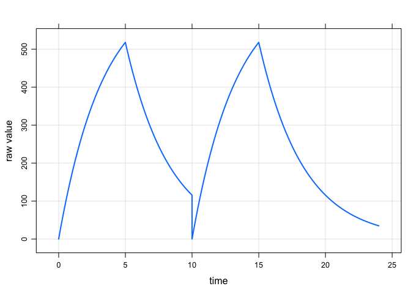
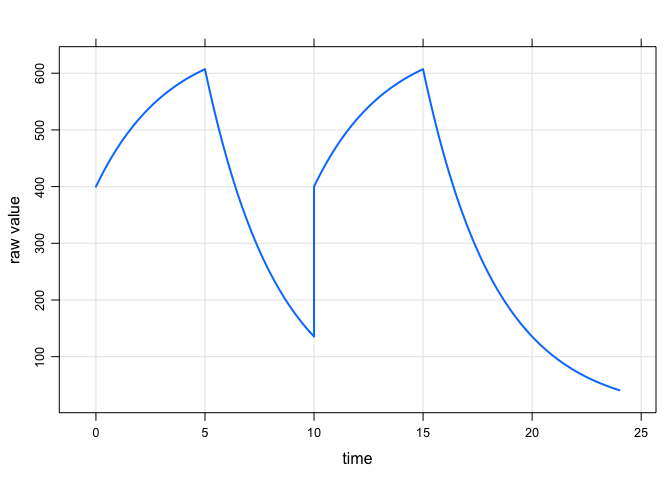
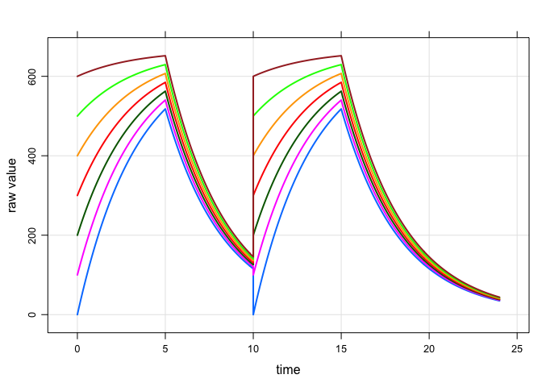
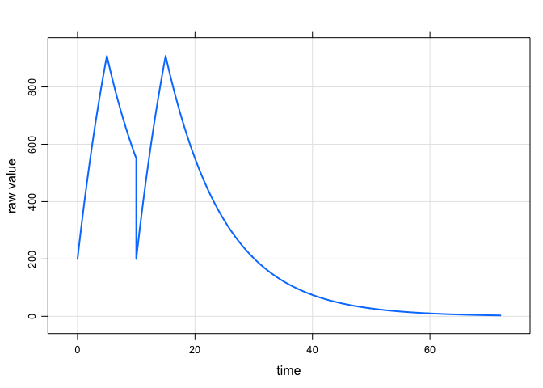

``` r
library(knitr)
opts_chunk$set(fig.path="img/evid4-")

library(mrgsolve)
```

    ## mrgsolve: Community Edition

    ## www.github.com/metrumresearchgroup

``` r
options(mrgsolve_mread_quiet=TRUE)
```

``` r
e1 <- ev(time=0,evid=1,amt=1000, rate=200)
e2 <- ev(time=10,evid=4,amt=1000,rate=200)
e <- e1 + e2
e
```

    ## Events:
    ##   time cmt  amt rate evid
    ## 1    0   1 1000  200    1
    ## 2   10   1 1000  200    4

Fine, but we expect compartments to start at zero
=================================================

``` r
code <- '
$PARAM KE=0.3
$CMT CMT
$ODE
dxdt_CMT = -KE*CMT;
'

mod <- mcode("reset",code)

out <- 
  mod %>% 
  ev(e) %>%
  mrgsim(delta=0.1)

out %>% plot
```

<!-- -->

This actually works
===================

I said it wouldn't work, but it does. It's sort of an accident ... but it happens correctly due to the way `init_call` is coded up.

``` r
out <- 
  mod %>% 
  init(CMT = 400) %>%
  ev(e) %>%
  mrgsim(delta=0.1)

out %>% plot
```

<!-- -->

Actually, this works too
========================

``` r
idata <- expand.idata(CMT_0 = seq(0,600,100))
out <- 
  mod %>% 
  idata_set(idata) %>%
  init(CMT = 400) %>%
  ev(e) %>%
  mrgsim(delta=0.1)

out %>% plot
```

<!-- -->

Fine .... the initial comes from `$MAIN`
========================================

``` r
code <- '
$PARAM KE=0.1,BASE=200

$CMT CMT

$MAIN
CMT_0 = BASE;

$ODE
dxdt_CMT = -KE*CMT;
'

mod <- mcode("base",code)

out <- 
  mod %>% 
  ev(e) %>%
  mrgsim(delta=0.1, end=72)

out %>% plot
```

<!-- -->
