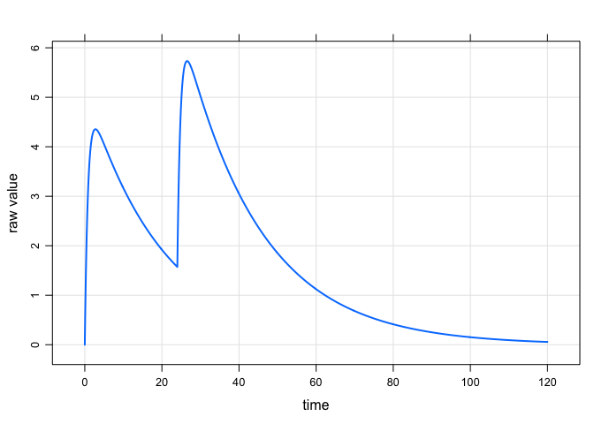
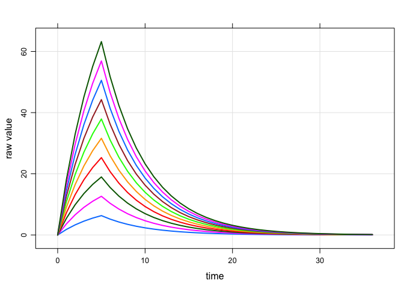

``` r
library(mrgsolve)
```

Use the house model

``` r
mod <- mrgsolve:::house() %>% update(delta=0.1) %>% Req(CP)
```

The default time grid

``` r
mod %>% 
  ev(amt=100,ii=24,addl=1) %>%
  mrgsim %>%
  plot
```

<!-- -->

We can start at 24 and end at 48; but this doesn't quite look right; we still get the dose at `time=0`

``` r
mod %>% 
  ev(amt=100,ii=24,addl=1) %>%
  mrgsim(start=24, end=48) %>%
  plot
```

<!-- -->

Drop the dose records from the output

``` r
mod %>% 
  ev(amt=100,ii=24,addl=1) %>%
  obsonly %>%
  mrgsim(start=24, end=48) %>%
  plot
```

<!-- -->

Another way to do it: set `end=-1` to get rid of that simulation time grid and the give `mrgsolve` an ad-hoc vector of times (`add`) to output.

You will still have to drop the dosing record to avoid seeing that record in the output.

``` r
mod %>% 
  ev(amt=100,ii=24,addl=1) %>%
  obsonly %>%
  mrgsim(end=-1, add=seq(24,48,0.1)) %>%
  plot
```

<!-- -->
