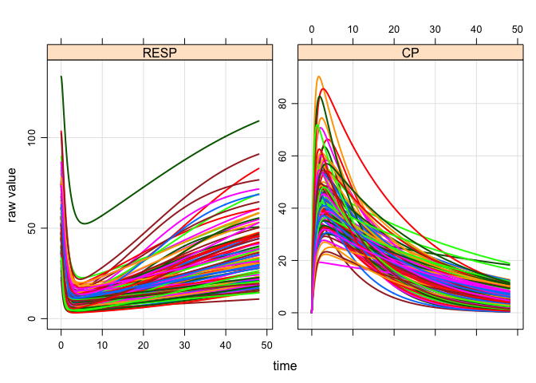

Sensitivity Analysis
====================

``` r
library(mrgsolve)
library(MASS)
```

A model PK/PD model.

-   Only interested in `CP` and `RESP` (the response from indirect response model) for now.

``` r
mod <- mrgsolve:::house() %>% Req(CP,RESP)
```

Sensitivity analysis on random values

-   Get the current parameter values for `CL`, `VC`, `KA`, `IC50`, and `KOUT`
-   Convert to numeric vector (just a regular `R` object\`)
-   Log-transform

``` r
mu <- log(as.numeric(param(mod))[s(CL,VC,KA,IC50,KOUT)])
mu
```

    .        CL        VC        KA      IC50      KOUT 
    . 0.0000000 2.9957323 0.1823216 2.3025851 0.6931472

Variance; this gives the same CV for each parameter. But feel free to customize this as you like, for each parameter.

``` r
Sigma <- diag(rep(0.1,length(mu)))

Sigma
```

    .      [,1] [,2] [,3] [,4] [,5]
    . [1,]  0.1  0.0  0.0  0.0  0.0
    . [2,]  0.0  0.1  0.0  0.0  0.0
    . [3,]  0.0  0.0  0.1  0.0  0.0
    . [4,]  0.0  0.0  0.0  0.1  0.0
    . [5,]  0.0  0.0  0.0  0.0  0.1

Simulate log-normal parameters

``` r
set.seed(111)
pars <- exp(mvrnorm(100, mu, Sigma)) %>% as.data.frame

head(pars)
```

    .          CL       VC        KA      IC50      KOUT
    . 1 0.8845798 20.92604 1.0918401 12.087858 2.1544393
    . 2 0.6386680 22.43684 0.9946435  6.928592 1.8013913
    . 3 1.0047854 18.77942 1.5585381 11.489558 1.8123115
    . 4 0.8688331 11.14171 0.6058183 10.669247 0.9656842
    . 5 0.6745067 19.01716 0.8967863  8.016361 1.8947965
    . 6 0.9883723 23.90201 1.4132088  7.460037 2.0907170

Simulate the response

-   We pass the parameters in as `idata`

``` r
mod %>%
  ev(amt=1000) %>%
  idata_set(pars) %>%
  mrgsim(end=72,delta=0.1) %>%
  plot
```

<!-- -->

For fixed parameter combinations you can look at all combinations like this:

``` r
pars <- expand.idata(CL=seq(0.5,1.5,0.1), IC50=seq(0.2,2,0.2), VC=seq(5,50,5))
head(pars)
```

    .   ID  CL IC50 VC
    . 1  1 0.5  0.2  5
    . 2  2 0.6  0.2  5
    . 3  3 0.7  0.2  5
    . 4  4 0.8  0.2  5
    . 5  5 0.9  0.2  5
    . 6  6 1.0  0.2  5

Or code the exact combinations you want to look at.

``` r
sessionInfo()
```

    . R version 3.2.3 (2015-12-10)
    . Platform: x86_64-apple-darwin13.4.0 (64-bit)
    . Running under: OS X 10.9.5 (Mavericks)
    . 
    . locale:
    . [1] en_US.UTF-8/en_US.UTF-8/en_US.UTF-8/C/en_US.UTF-8/en_US.UTF-8
    . 
    . attached base packages:
    . [1] stats     grDevices utils     datasets  graphics  methods   base     
    . 
    . other attached packages:
    . [1] knitr_1.12.3         MASS_7.3-45          mrgsolve_0.5.11.9005
    . 
    . loaded via a namespace (and not attached):
    .  [1] Rcpp_0.12.4     lattice_0.20-33 digest_0.6.9    dplyr_0.4.3    
    .  [5] assertthat_0.1  grid_3.2.3      R6_2.1.2        DBI_0.3.1      
    .  [9] formatR_1.3     magrittr_1.5    evaluate_0.8.3  stringi_1.0-1  
    . [13] lazyeval_0.1.10 rmarkdown_0.9.5 tools_3.2.3     stringr_1.0.0  
    . [17] yaml_2.1.13     parallel_3.2.3  htmltools_0.3.5
